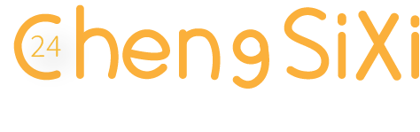

[【LANGUAGE HELP】](https://github.com/ChengSiXi24/ChengSiXi24/blob/main/languagehelp.md)

## ✨橙四希24

👨‍💻开发者，目标为“创建的软件简单、简洁、方便且个性化程度高”

我正在学习编程，我的能力有限(还只是学生👨‍🎓)，还请大家谅解。

### 💼组织(工作组/工作室)

[前往组织Github页面](https://github.com/FavoriteSeasons)

## 🍀近期信息

目前我会利用假期时间(不一定完成)

### 🧪研究开发

* 🧱轻量的二维平面ADV引擎 ： Ovp[^Ovp]（采用技术没有确定，内部大概设计的差不多了）
  - *这个引擎将包含在Ovp-Project[^Ovp-Project]里*
* 🧱多对象Tag标签分析工具 ： Data Tag It!
* 🧱Windows系统增强工具箱 ： WinToffee++ 视窗奶糖

### 🎓学习

* 💡语言 C/C++/C#等
* 💡库及其他 OpenGL/DirectX/GDI等
* 💡学习设计 ADV/GAL并制作开发文档
* 🎮~~游玩更多Gal/ADV，看番等~~(这是首要的😝)

 
## ☕额外信息

> ⏱️ 我想下一个项目应该研发还需要很长一段时间。
>
> 💬 您也可以在其他社交平台与我通信或提交反馈哦!😉
>
> 📫 联系我: ✉ chengsixi@qq.com QQ 1423360499
>
> 🎇 每天都要开心哦！ 🎉
> 
> 🌈 让我们展望未来！  (≧∇≦)/ 😚

## 📕部分解释

[^Ovp]: Ovp全称 Orange Visual Presenter是一个ADV/Gal游戏引擎，也是 Ovp-project 的一部分
[^Ovp-Project]: Ovp-Project是一个ADV/Gal游戏的项目，是一个包括Ovp引擎、TinySystem系统与开发工具等程序的项目集。
